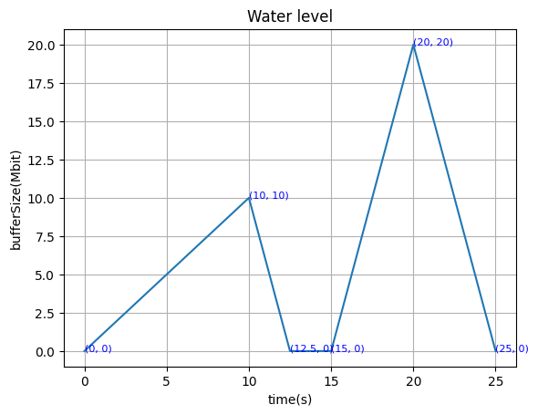
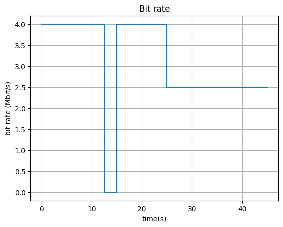
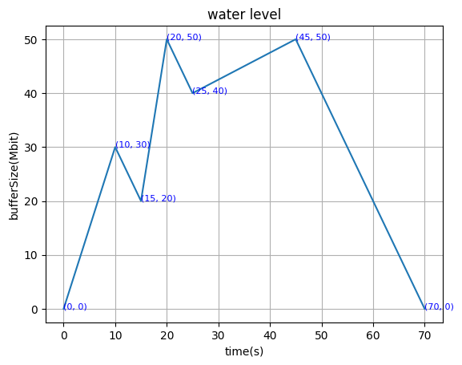
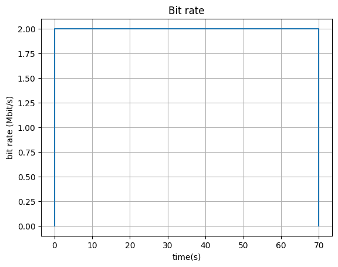
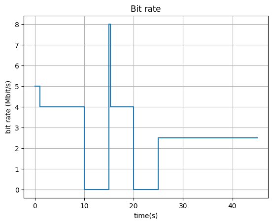
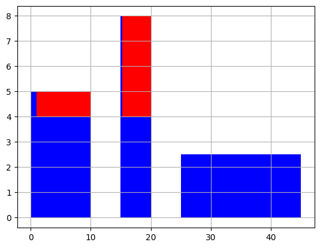
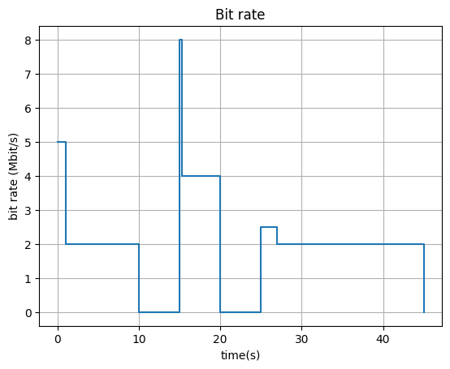
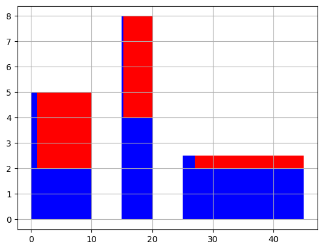

## 1

- Goal: to ensure the QoS of the IP network, to regulate the incoming traffic and try to bring them into compliance of the  Service Level Agreement (SLA)

- Difference: traffic policing only mark or discard the non-conforming packet, it will not delay them; traffic shaping buffer and delay the non-conforming packets during peaks.
  
  ## 2
  
  The water level is shown in the following picture, and the essential points are marked.

Illustration:

- From 0-10s the incoming rate is 5Mbit/s while the transmitting rate is 4Mbit/s so the water level increases at the speed of 1Mbit/s
- From 10-12.5s there is no incoming data, and transmitting rate is 4Mbit/s, so the water level drops at the speed of 4Mbit/s
- From 12.5-15 s there is no incoming data and no output data since the buffer is empty
- From 15-20s the incoming rate is 8Mbit/s while the transmitting rate is 4Mbit/s so the water level increases at the speed of 4Mbit/s
- From 20-25s there is no incoming data, and transmitting rate is 4Mbit/s, so the water level drops at the speed of 4Mbit/s
- From 25-40s both incoming and transmitting rate is 2.5Mbit/s so the buffer remains empty

  

## 3

Essential points in this graph are (0,4),(12.5,4),(12.5,0),(15,0),(15,4),(25,4),(25,2.5),(45,2.5).

The illustration is the same with the illustration in question 2.

## 4

Illustration:

- From 0-10s the incoming rate is 5Mbit/s and the output rate is 2Mbit/s so the water level increases at the speed of 3Mbit/s
- From 10-15s there is no incoming data, and output rate is 2Mbit/s, so the water level drops at the speed of 2Mbit/s
- From 15-20s the incoming rate is 8Mbit/s and the output rate is 2Mbit/s so the water level increases at the speed of 6Mbit/s
- From 20-25s there is no incoming data, and output rate is 2Mbit/s, so the water level drops at the speed of 2Mbit/s
- From 25-45s the incoming rate is 2.5Mbit/s and the output rate is 2Mbit/s so the water level increases at the speed of 0.5Mbit/s
- From 45-70s the output rate is 2Mbit/s so the water level increases at the speed of 2Mbit/s

## 5

Illustration:

- At the beginning the token bucket is assumed to be full
- From 0-1s the burst is allowed, the output rate is 5Mbit/s
- From 1-10s the token bucket is empty, therefore the output rate is 4Mbit/s
- From 10-15s, no input, no output
- From 15-15.25s the token bucket is full, and the burst happens.The output rate is 8Mbit/s
- From 15.25-20s  the token bucket is empty, therefore the output rate is 4Mbit/s
- From 20-25s, no input, no output
- From 25-45s, no burst, output rate is 2.5Mbit/s

## 6

The illustration is the same with that in question 5.

## 7

## 8

- 10KB: 300ms. The transmission takes 4 round(1,2,4,1 packets in each round), which totally takes 175ms. The 3-way handshake is 75ms and the processing time is 50s. So in total 300ms
- 20KB: 300ms. The transmission takes 4 round(1,2,4,8 packets in each round), which totally takes 175ms. The 3-way handshake is 75ms and the processing time is 50s. So in total 300ms
- 50KB: 400ms. The transmission takes 6 round(1,2,4,8,16,5 packets in each round), which totally takes 275ms. The 3-way handshake is 75ms and the processing time is 50s. So in total 400ms

## 9

- 10KB: 200ms. The transmission takes 2 round(5,3 packets in each round), which totally takes 75ms. The 3-way handshake is 75ms and the processing time is 50s. So in total 200ms
- 20KB: 200ms. The transmission takes 2 round(5,10 packets in each round), which totally takes 755ms. The 3-way handshake is 75ms and the processing time is 50s. So in total 200ms
- 50KB: 300ms. The transmission takes 4 round(5,10,20,1 packets in each round), which totally takes 175ms. The 3-way handshake is 75ms and the processing time is 50s. So in total 300ms

## 10

- 10KB: 550ms. The transmission takes 4 round(1,2,4,1 packets in each round), which totally takes 350ms. The 3-way handshake is 150ms and the processing time is 50s. So in total 550ms

- 20KB: 550ms. The transmission takes 4 round(1,2,4,8 packets in each round), which totally takes 350ms. The 3-way handshake is 150ms and the processing time is 50s. So in total 550ms

- 50KB: 750ms. The transmission takes 6 round(1,2,4,8,16,5 packets in each round), which totally takes 550ms. The 3-way handshake is 150ms and the processing time is 50s. So in total 750ms
  
  ## 11

$$
Transfer time = RTT+RTT\times \lceil log_2 { \frac{ \lceil fileSize/mss \rceil}{cwnd} +1} \rceil
$$

### 12

The signaling phase is formulated as a m/m/1 model. 

- Suppose the rate of incoming request is $\lambda$
- The average process duration is $\beta_1 = 0.8s$

The streaming phase is an erlang-b model

- the rate of incoming request is still $\lambda$
- the average process duration is  $ \beta_2 = 5400$ s

### 13

Suppose $N_1$ is number of customers in system, then the time for setting up a connection is $\beta_1 E[N_1]+\beta_1$. According to m/m/1 model, this equals to $ t=\frac{\beta_1}{1-\lambda \beta_1} =\frac{0.8}{1-0.8 \lambda} $

### 14

let $ t<2 $, then we can calculate that $\lambda$ should be less than 0.75. so the maximum number of connection set-up requests per
minute that can be handled is 0.75

### 15

The number of sessions which can be handled simultaneously is n=1G/10M=102. 
The streaming phase is a erlang-b model, so the block probability is 
$ \frac{\frac{(\lambda\beta_2)^n}{n!}}{\sum_{i=0}^{N} \frac{(\lambda\beta_2)^i}{i!}} $ where n=102 and $ \beta_2 = 5400 $